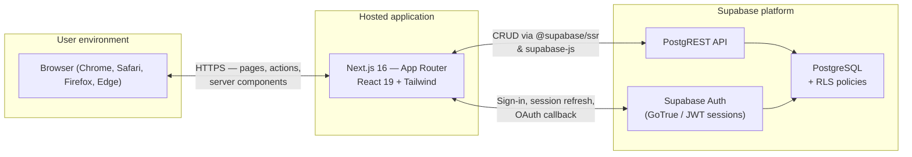
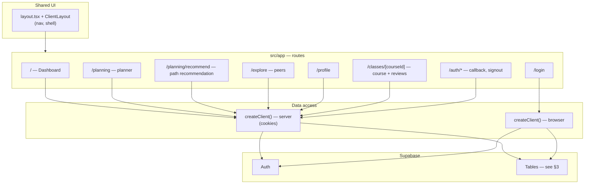
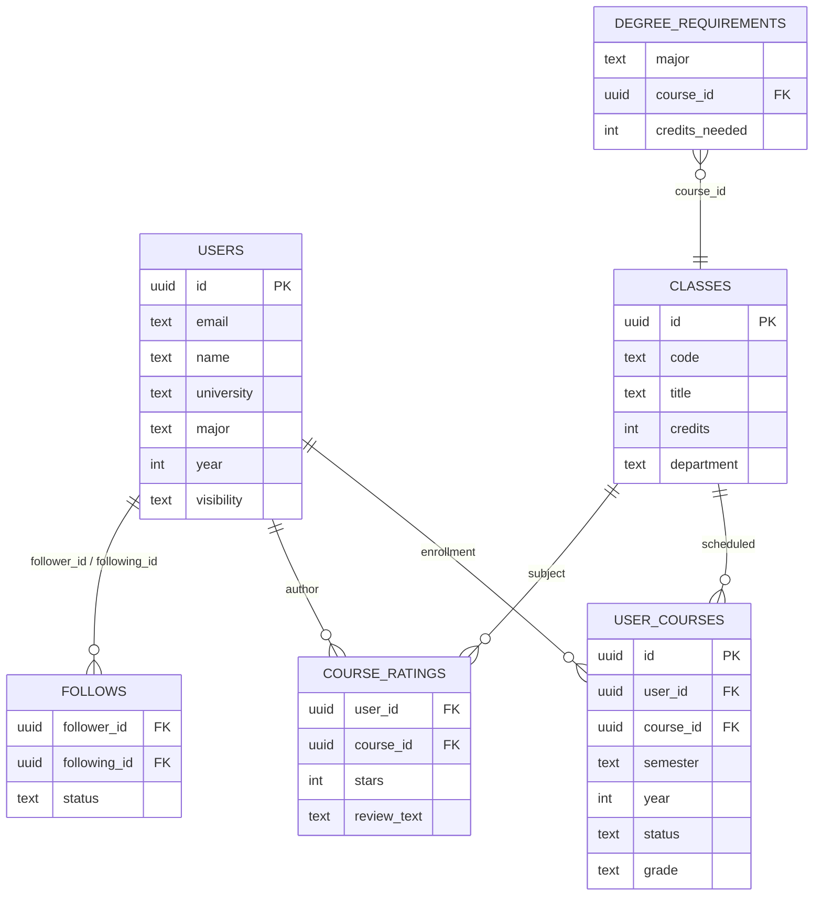
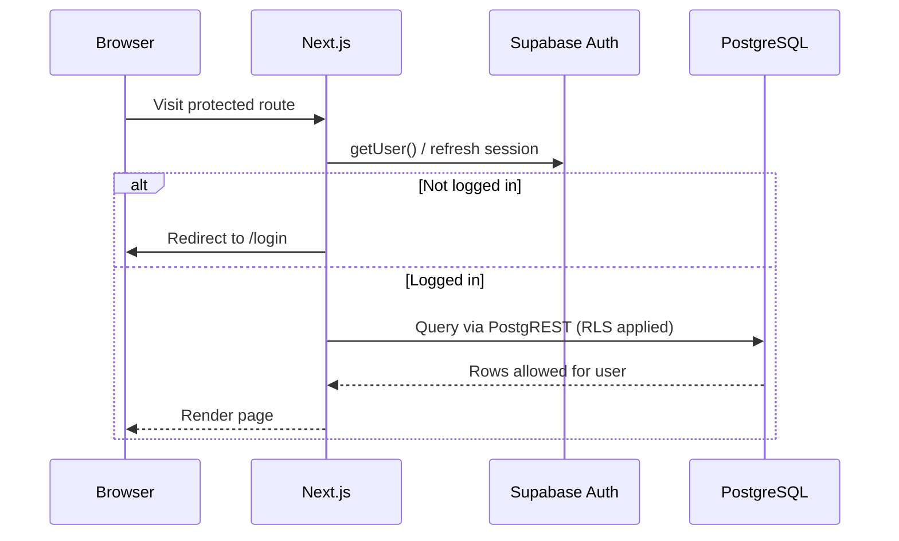

# Gradly — architecture & design

This document conceptualizes how the Gradly platform fits together: the **client and hosting surface**, the **Next.js application**, and the **Supabase backend** (Auth + PostgreSQL). It reflects the tables and flows used in the app today, aligned with the broader product model in [`PRD.md`](../PRD.md).

---

## 1. System context (platform boundaries)

Students use a **web browser**. The app is a **Next.js** deployment (e.g. Vercel) that talks to **Supabase** for authentication and data. Supabase exposes **PostgREST** over PostgreSQL; **Row Level Security (RLS)** enforces access rules in the database.

**Notes**

- Session cookies are managed by `@supabase/ssr` on the server and in middleware-style logic (`src/proxy.ts`) so visits stay authenticated.
- No separate custom API server: the app uses Supabase as the **Backend-as-a-Service** data plane.

---

## 2. Application architecture (Gradly `gradly/` app)

The UI is organized by **App Router** routes. **Server Components** and **server actions** use `src/lib/supabase/server.ts`; interactive views use **client components** with `src/lib/supabase/client.ts`. Domain logic for planning and paths lives under `src/lib/utils/` (e.g. `planning.ts`, `pathfinding.ts`, `pathfinder.ts`, `semester.ts`).

**Feature ↔ data (high level)**

| Area | Route(s) | Primary persistence |
|------|-----------|---------------------|
| Dashboard & progress | `/` | `users`, `user_courses` |
| Planner & catalog | `/planning` | `classes`, `user_courses`, `course_ratings` |
| Recommendations | `/planning/recommend` | `degree_requirements`, `user_courses`, `classes` |
| Social | `/explore`, `/explore/[userId]`, schedule | `users`, `follows`, `user_courses` |
| Course intel | `/classes/[courseId]` | `classes`, `user_courses`, `course_ratings` |
| Profile | `/profile` | `users` |

---

## 3. Backend database (PostgreSQL / Supabase)

The product PRD names a **`courses`** entity; the running app uses a **`classes`** table as the course catalog. **`users`** holds app profile fields (linked to Auth user ids). **`user_courses`** is the bridge between users and planned or completed classes. **`degree_requirements`** drives recommendation inputs. Additional PRD tables such as **`path_plans`** may be introduced as the recommendation flow matures.

Public **`users`** rows use the same `id` as **`auth.users`** (Supabase Auth). The catalog table is **`classes`** (referenced as `course_id` from planner and ratings code).

**Security model (conceptual)**

- **Authentication**: Supabase Auth; JWT/session reflected in cookies.
- **Authorization**: **RLS** on tables so users read/write only what policies allow (e.g. own `user_courses`, public profile fields for explore, etc.). Policies live in Supabase, not in this repo’s diagrams.

---

## 4. Auth & session flow (simplified)

---

## How to view these diagrams

- **GitHub / GitLab**: Mermaid renders in Markdown previews.
- **VS Code / Cursor**: Use a Mermaid preview extension, or paste into [mermaid.live](https://mermaid.live).

For setup and repo layout, see the [project README](../README.md).
